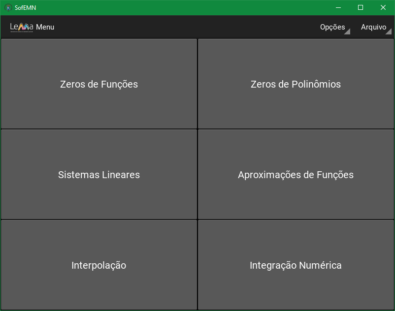

# SofEMN
Software para Ensino de Métodos Numéricos


# Sobre o Software
Desenvolvido como projeto de pesquisa e extensão pelo Laboratório de Estudos em Matemática Aplicada (LEMA), este software visa ser uma ferramenta para auxílio no ensino e aprendizado da matéria de Métodos Numéricos e Computacionais. Foi utilizado o plano de ensino dessa matéria da Universidade Federal de Santa Maria Campus Cachoeira do Sul (UFSM-CS) com os seguintes métodos desenvolvidos:

## Menu


## Métodos Numéricos Desenvolvidos
- Zeros de Funções
- Zeros de Polinômios
- Sistemas Lineares
- Aproximações de Funções
- Interpolação
- Integração Numérica

# Dependências
### <a href="https://kivy.org/#home">Kivy</a>
```
pip install --upgrade pip setuptools virtualenv
```
### <a href="https://matplotlib.org/stable/index.html">Matplotlib</a>
```
pip install -U matplotlib
```
### <a href="https://www.scipy.org/">Scipy</a>
```
pip install --user numpy scipy matplotlib ipython jupyter pandas sympy nose
```
# Compilar
```
pyinstaller --noconfirm --onefile --windowed --icon "Img/UFSM.ico" --add-data "Img;Img/" "./SofEMN.py"
```
## Dependências:
### <a herf="https://www.pyinstaller.org/">Pyinstaller</a>
```
pip install pyinstaller
```


