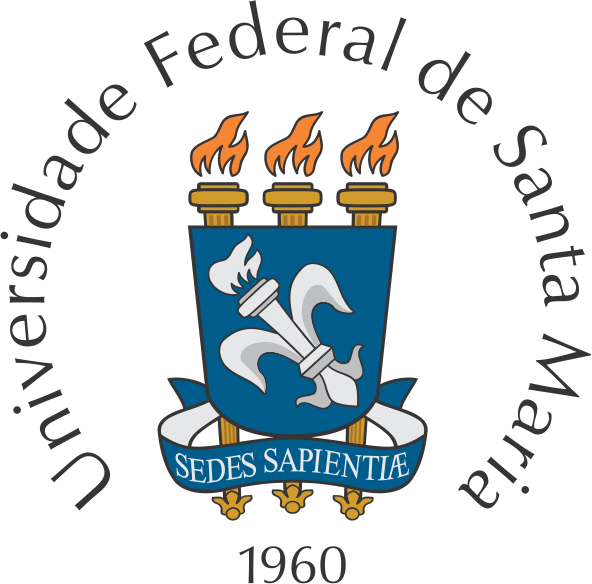
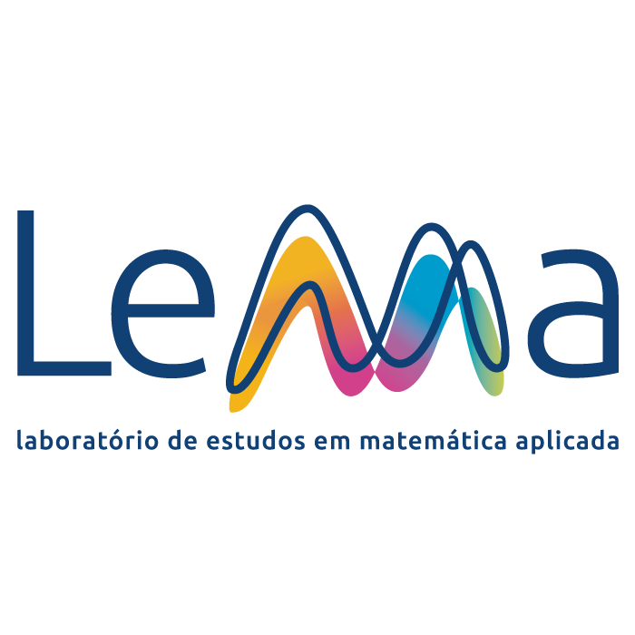
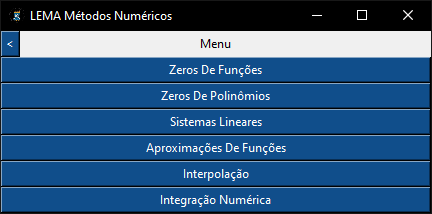

# Sobre o Software
Desenvolvido como projeto de pesquisa e extensão pelo Laboratório de Estudos em Matemática Aplicada (LEMA), este software visa ser uma ferramenta para auxílio no ensino e aprendizado da matéria de Métodos Numéricos e Computacionais. Foi utilizado o plano de ensino dessa matéria da Universidade Federal de Santa Maria Campus Cachoeira do Sul (UFSM-CS) com os seguintes métodos desenvolvidos:

## Menu


## Métodos Numéricos Desenvolvidos
- [x] Zeros de Funções
- [x] Zeros de Polinômios
- [x] Sistemas Lineares
- [x] Aproximações de Funções
- [x] Interpolação
- [x] Integração Numérica

# Dependências
Para utilizar deve-se instalar:
```
pip install matplotlib
```
```
pip install mpmath
```
```
pip install pandas
```
```
pip install scipy
```
Todos de uma vez:
```
pip install matplotlib mpmath pandas scipy
```